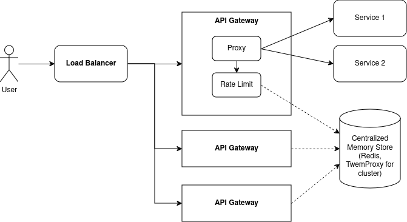
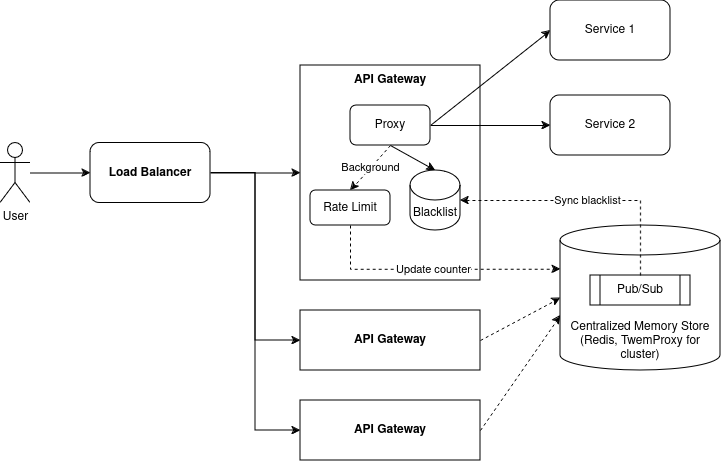

# ratelimiter-example

Example of implementing a ratelimiter

## The problem

> Implement a simple ratelimiter in API Gateway to ensure resistance to Brute Force attacks and DDOS attacks.

## Coding challenge

### Prerequisites

- Golang 1.22

### Solution 1: The sliding window algorithm (with counter per second)

I choose grouping by second as the unit of time, and store the counter per second to ensure the minimum precision of the ratelimiter is one second.

**Pros:**

- Very accurate, the minimum precision of the ratelimiter is one second.
- This algorithm is simple and easy to implement both in the API Gateway itself or in the centralize store like Redis (using SortedSet)

**Cons:**

- Memory usage grows linearly with window duration (but can be controlled). We can also reduce memory usage and consumed time and sacrifice accuracy with this algorithm by increasing the grouping unit to minute.
- Not effective because we need to loop through all the counter to remove the expired ones and sum them to find the number of requests in the current window.

```golang
type SlidingWindowRateLimiter struct {
	rate           int           // Maximum number of requests allowed in the windowDuration.
	windowDuration time.Duration // Duration of the sliding window.
	requests       map[int64]int // Map to hold request counts for each second within the window.
}

// AllowRequest determines whether a new request at the current time should be allowed.
func (rl *SlidingWindowRateLimiter) AllowRequest(requestTime time.Time) bool {
	// Round the request time down to the nearest second to group requests by second.
	requestTimeSecond := requestTime.Truncate(time.Second).Unix()

	// Clean up old requests that are outside the current window and count the number of requests in the current window.
	startOfWindow := requestTime.Add(-rl.windowDuration).Unix()
	currentCount := 0

	for timestamp, count := range rl.requests {
		if timestamp < startOfWindow {
			delete(rl.requests, timestamp)
		} else {
			currentCount += count
		}
	}

	// If the current window is not full, allow the request and update the counter.
	if currentCount < rl.rate {
		rl.requests[requestTimeSecond]++
		return true
	}

	// Otherwise, deny the request.
	return false
}
```

To run this solution over sample test case, run the following command:

```bash
cat testcase-sample.txt | go run sliding-window-counter.go
```

### Solution 2: The leaky bucket algorithm

Since the sliding window algorithm is accurate but not very effective, I think in the real world, we need to consider other algorithms to achieve a better ratelimiter. The leaky bucket is one of them.

**Pros:**

- Very low memory usage
- This algorithm is simple and easy to implement both in the API Gateway itself or in the centralize store like Redis

**Cons:**

- Not very accurate, the ratelimiter will let some requests at the end of the time window pass through even if the maximum number of requests allowed in the windowDuration has been reached.

```golang
type LeakyBucketRateLimiter struct {
	capacity       float64       // The maximum capacity of the bucket.
	windowDuration time.Duration // The duration of the sliding window.
	lastUpdate     time.Time     // The last time the bucket was updated.
	current        float64       // The current amount of requests in the bucket.
}

// NewLeakyBucketRateLimiter creates a new rate limiter instance.
func NewLeakyBucketRateLimiter(rate int, windowDuration time.Duration) *LeakyBucketRateLimiter {
	return &LeakyBucketRateLimiter{
		capacity:       float64(rate),
		windowDuration: windowDuration,
		current:        0,
	}
}

// AllowRequest determines whether a new request should be allowed.
func (lb *LeakyBucketRateLimiter) AllowRequest(requestTime time.Time) bool {
	// Calculate time elapsed since the last request.
	elapsed := requestTime.Sub(lb.lastUpdate).Seconds() / lb.windowDuration.Seconds()

	// Leak the bucket based on the elapsed time.
	lb.current -= elapsed * float64(lb.capacity)
	if lb.current < 0 {
		lb.current = 0
	}
	lb.lastUpdate = requestTime

	// If the bucket is not full, allow the request and update the bucket current amount.
	if math.Ceil(lb.current) < lb.capacity {
		lb.current++
		return true
	}

	// Otherwise, the request is denied.
	return false
}
```

To run this solution over sample test case, run the following command:

```bash
cat testcase-sample.txt | go run leaky-bucket.go
```

## Designing cluster challenge

To implement an API Gateway cluster with the same ratelimiter, we need to make sure the ratelimiter is shared across all the API Gateway instances. To achieve this, we need to use a centralized storage (prefer memory store) like Redis to store the ratelimiter's data. Overall design:



In this design, I place a Load Balancer in front of the API Gateway instances. The Load Balancer will distribute the incoming requests to the API Gateway instances. Then, each API Gateway instance will connect to the Redis server to update the ratelimiter's data and make decisions based on it.

### The bottleneck

Since the API Gateway instances are stateless, the bottleneck of this design will be the Redis server. To solve this problem, based on the requirement about request characteristics, we will choose between the Redis Sentinel and Redis Cluster to deploy this centralized storage. Redis Sentinel will make our storage High Availability but still not scalable. On the other hand, Redis Cluster will distribute the data across multiple Redis instances and make our storage scalable. But to utilize the Redis Cluster, we need to store the data with difference keys based on request characteristics so that we can fully utilize the Redis Cluster's sharding feature.

For example, if we have only few global ratelimiters and using a few Redis key to store the data, then using Redis Cluster will not help us much. But if we have a lot of ratelimiters based on client's ip address, then we can use the Redis Cluster to store the data with many different keys.

### The performance

Since Redis is a memory-based storage, the performance of Redis itself is not a big problem. But the performance of the API Gateway will be affected not only by the Redis server but also by the network latency between it and the Redis server. So if the network latency is too high, the API Gateway will be slowed down.

One thing that needs to be considered is the ability to handle high load during Brute Force attack or DDOS attack. Checking every request with Redis in a synchonous way will make the API Gateway to be blocked by malicious requests and affecting other good requests. In that situation, I think we should sacrifice the accuracy of the ratelimiter and implement some modifications to make the API Gateway more resilient:

- Using a faster algorithm to calculate the ratelimiter's data, such as the leaky bucket algorithm or sliding window based on fixed window request counter.
- Instead of checking every request with the ratelimiter, only check for blocked characteristics like client's ip address in some Blacklist. We can store those Blacklist in the memory of each API Gateway instance and sync them with the Redis server periodically or using a pub/sub mechanism.
- Increase request counter in the background through bulk operations so that the API Gateway's performance will not be affected much by the high load.



This approach can let some bad requests pass through as it doesn't check ratelimiter when serving requests. But to serve a massive amount of requests, it will be an acceptable tradeoff to boost the API Gateway's performance.